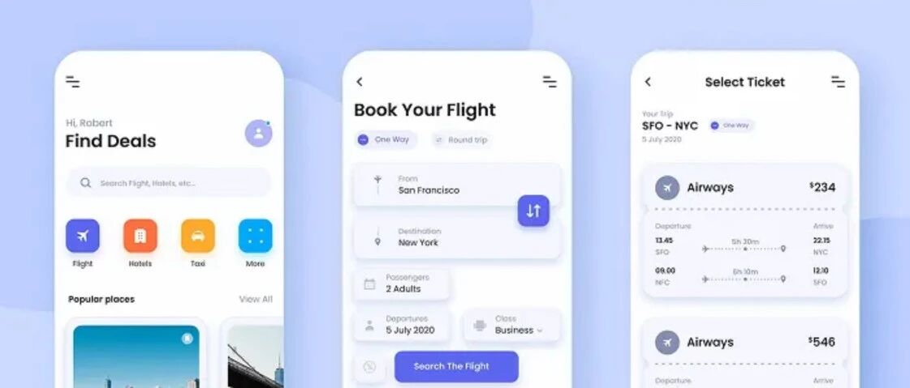
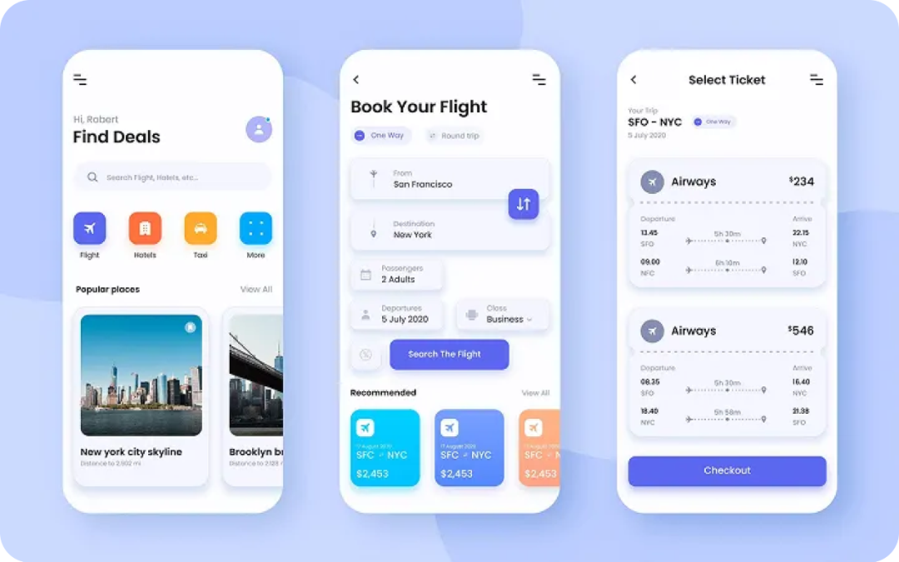

# Tâm lý học đằng sau thiết kế UI xuất sắc

- Tiêu đề gốc: 优秀 UI 设计背后的心理学
- Tác giả: TCC翻译情报局
- Thời gian đăng: 2025年10月21日 07:31
- Link gốc: https://mp.weixin.qq.com/s/Vj084e7O3mIgeVOWmE1JJw
- Nguồn tham chiếu: https://medium.muz.li/the-psychology-behind-great-ui-design-54e24af5a63a

## Tóm tắt nội dung
Bài viết giải thích các nguyên lý tâm lý học đứng sau UI tốt: giảm tải nhận thức, rút gọn lựa chọn (希克定律), tối ưu kích thước/vị trí mục tiêu tương tác (菲茨定律), xây dựng trật tự thị giác, tận dụng hiệu ứng quen thuộc (convention), áp dụng nguyên lý格式塔（nhóm theo gần/giống/đối齐/连续）, và thiết kế cảm xúc (microcopy/animation) để tăng cảm giác kiểm soát và tin cậy.

## Nguyên lý chính (rút gọn)
- Nhận thức & tải não:
  - Thiết kế để người dùng không phải “giải đố”; ưu tiên một hành động chính mỗi màn hình; giấu phức tạp vào “cài đặt nâng cao”.
- Hick’s Law – rút gọn lựa chọn:
  - Ít lựa chọn hơn → quyết định nhanh hơn; chia nhỏ tác vụ; dùng mặc định hợp lý.
- Fitts’s Law – mục tiêu dễ bấm:
  - Tăng kích thước vùng chạm, bố trí phù hợp vùng ngón tay cái trên mobile; tránh đặt nút quá sát gây lệch bấm.
- Trật tự thị giác:
  - Dùng kích thước, màu, độ đậm, khoảng cách để dẫn hướng; khai thác khoảng trắng.
- Tính quen thuộc hơn sáng tạo “lạ”:
  - Quy trình quan trọng (đăng ký, thanh toán, dẫn hướng) nên theo pattern chuẩn; sáng tạo ở vi tương tác.
- 格式塔（Gestalt）:
  - Nhóm trường liên quan; nút tương tự → hành vi tương tự; canh lề nhất quán để giảm nhiễu.
- Thiết kế cảm xúc:
  - Vi tương tác, microcopy tạo cảm giác an tâm; phản hồi rõ ràng tránh nghi hoặc.

## Hình ảnh (nhúng từ bài gốc)
> Lưu ý: ảnh WeChat có thể yêu cầu mở trong trình duyệt/WeChat để hiển thị đầy đủ.

- Ảnh cover (OG):

  

- Một số ảnh nội dung:

  

  

  

  

## Phân loại đề xuất
- Thư mục: 04_Guides_Tutorials
- Lý do: Nội dung mang tính hướng dẫn/khái niệm nền về UI/UX.

---
Gợi ý: Có thể bổ sung checklist UI dựa trên mỗi nguyên lý (ví dụ: mục tiêu tương tác ≥44px, phân nhóm trường biểu mẫu, default hợp lý…).
