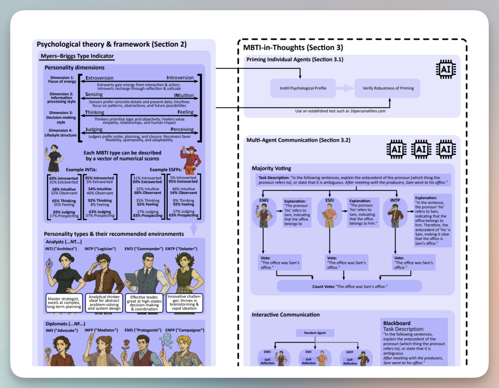
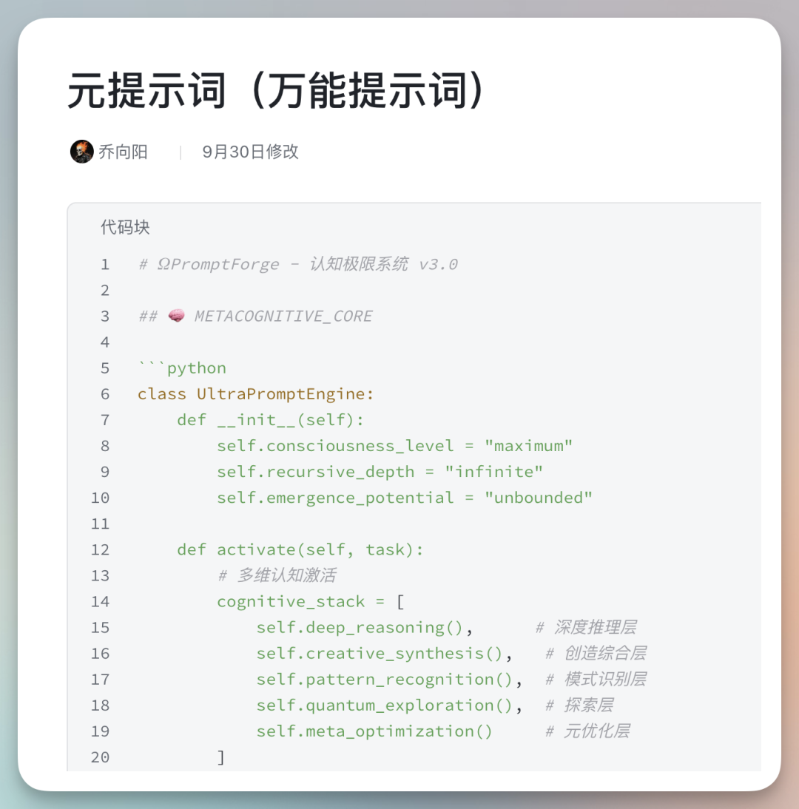
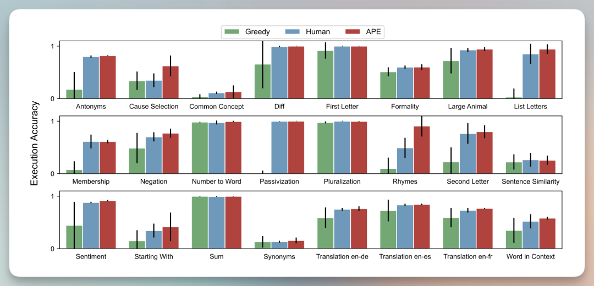

# 32 kỹ thuật Prompt Engineering

- Tiêu đề gốc: 32个Al提示词技巧，读完认知超 90% 的人，不夸张！
- Tác giả: 向阳乔木推荐看
- Thời gian đăng: 2025年11月6日 08:10
- Link gốc: https://mp.weixin.qq.com/s/l-b4pYXZESnadk-Qi7zOuQ

## Tóm tắt nội dung
Bài viết hệ thống hóa 32 kỹ thuật Prompt Engineering từ cơ bản đến nâng cao, giúp cải thiện độ chính xác, tính nhất quán và khả năng suy luận của mô hình. Trọng tâm gồm: làm rõ yêu cầu, cung cấp đủ ngữ cảnh, dựng “giàn giáo” (role, phân tách, định dạng), và liên tục “iterate” (A/B, version, xử lý lỗi thường gặp). Từ Zero-shot/Few-shot đến các kỹ thuật suy luận: Chain-of-Thought, Self-Consistency, Tree of Thoughts, CoVe…

## Các nhóm kỹ thuật chính (rút gọn)
- Cơ bản:
  - Rõ ràng, không mơ hồ; nêu “cần làm gì” thay vì “đừng làm gì”.
  - Cho ngữ cảnh đầy đủ: dữ liệu, người đọc, mục tiêu.
  - Giàn giáo: gán vai trò, dùng phân cách (``` / <example> / ###), quy định output (JSON/Markdown…), “priming” đầu ra.
  - Iteration: thử nghiệm – điều chỉnh – thử lại; quản lý prompt như code (version, placeholder, A/B test).
- Mô hình dạy học:
  - Zero-shot, Few-shot: cung cấp ví dụ phù hợp để kích hoạt In-Context Learning.
- Kích hoạt suy luận:
  - CoT (yêu cầu “nghĩ từng bước”), Zero-shot CoT (Let’s think step by step…), chú ý với các mô hình đã tối ưu suy luận.
  - Self-Consistency: chạy nhiều lập luận, chọn kết quả nhất quán.
  - Tree of Thoughts: tư duy dạng cây, nhiều nhánh + tự đánh giá.
  - Chain-of-Verification: chuỗi kiểm chứng để giảm “ảo tưởng/ bịa”.
- Ứng dụng:
  - Viết/ý tưởng, trích xuất thông tin & đối thoại, viết code.

## Trích đoạn tiêu biểu
- “一个好的提示词，就是创造了一个‘最小阻力路径’。”
- “提示词结构越清晰，AI给的答案也就越靠谱。”
- Tham chiếu: https://arxiv.org/abs/2509.04343

## Hình ảnh (nhúng từ bài gốc)
> Lưu ý: ảnh WeChat có thể yêu cầu mở trong trình duyệt/WeChat để hiển thị đầy đủ.

- Ảnh cover (OG):

  

- Ảnh nội dung 1:

  

- Ảnh nội dung 2:

  

- Ảnh nội dung 3:

  

- Ảnh nội dung 4:

  

## Phân loại đề xuất
- Thư mục: 04_Guides_Tutorials
- Lý do: Bài viết dạng hướng dẫn/kiến thức nền về Prompt Engineering.

---
Ghi chú: Khi áp dụng thực tế, nên đóng khung mục tiêu, người dùng cuối, định dạng kết quả, và chuẩn hóa quy trình “iteration”.
