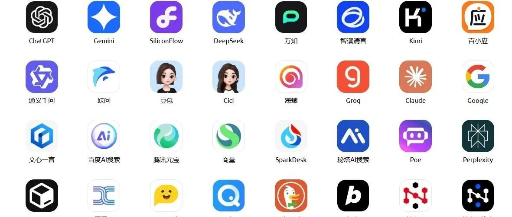
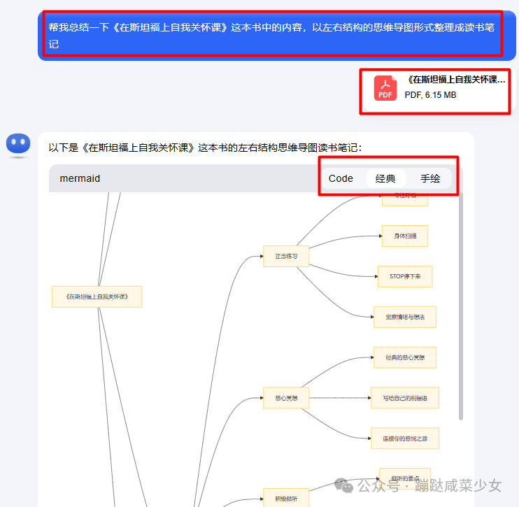
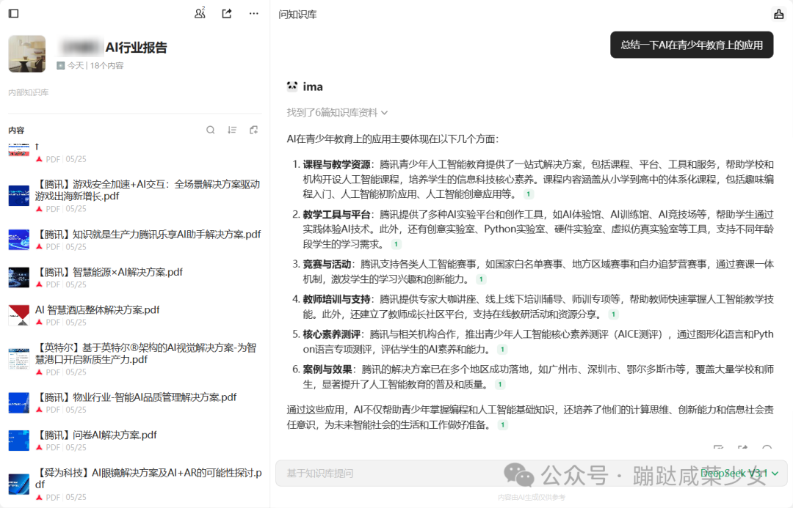

# Hệ thống hiệu suất với AI: tiết kiệm 5 giờ/tuần (3 kịch bản)

- Tiêu đề gốc: 实操3个月：我搭建了一套AI效率系统，每周省下5小时（附3个场景指南）
- Tác giả: 蹦跶咸菜少女
- Thời gian đăng: 2025年11月7日 11:58
- Link gốc: https://mp.weixin.qq.com/s/6pfo29px049eNHUNGf_08w

## Tóm tắt nội dung
Tác giả chia sẻ cách thực hành 3 tháng để xây dựng hệ thống hiệu suất với AI, giúp tiết kiệm ~5 giờ/tuần. Trọng tâm là 3 tình huống ứng dụng: đọc sách hiệu quả, xử lý bài viết đã lưu để tạo “bộ não thứ hai”, và khép kín quy trình họp (chuẩn bị – ghi – chốt hành động) bằng công cụ AI.

## 3 tình huống ứng dụng
- Đọc sách hiệu quả (300 trang/2 giờ):
  1) Kimi tạo tóm tắt toàn sách → định trọng tâm.
  2) DeepSeek giải thích đoạn khó → gắn ví dụ thực tế.
  3) Kimi chuyển kiến thức thành sơ đồ tư duy → lưu Tencent ima, gắn tag.
  4) Củng cố: sinh ghi chú chương theo khung “quan điểm –案例–启发 hành động”。
- Bài viết đã lưu → tiêu hóa & gọi lại nhanh:
  1) Thu thập: chuyển 1-click vào Tencent ima.
  2) Xử lý: mỗi tuần 30’ tóm tắt theo khung “vấn đề–3 điểm/数据–启发”, sinh 3–5 tags.
  3) Lưu trữ: đưa vào thư mục đúng trên Feishu Knowledge Base → tra cứu nhanh.
- Họp: 5 phút ra biên bản & action plan:
  - Trước họp: dùng 豆包 tạo đề cương, câu hỏi chính.
  - Trong họp: dùng 通义听悟 ghi âm &转写，标记重点。
  - Sau họp: nhờ 豆包 trích kết luận và tạo bảng hành động (việc, người phụ trách, deadline).

## Nguyên tắc cốt lõi
- Mục tiêu không chỉ là “tiết kiệm thời gian” mà là “giảm tải nhận thức”. AI lo ghi chép & xử lý sơ cấp; bạn tập trung vào tư duy, quyết định, sáng tạo.

## Khuyến nghị thực hành
- Bắt đầu từ một “điểm đau” cụ thể.
- Đặt lịch xử lý cố định (đặc biệt với bài viết đã lưu).
- Iteration prompt: cụ thể hóa yêu cầu, chuẩn hóa cấu trúc.
- Công cụ phục vụ tư duy vòng kín “输入-处理-内化-输出”。

## Hình ảnh (nhúng từ bài gốc)
> Lưu ý: ảnh WeChat có thể yêu cầu mở trong trình duyệt/WeChat để hiển thị đầy đủ.

- Ảnh cover (OG):

  

- Một số ảnh nội dung:

  

  

  

  

## Phân loại đề xuất
- Thư mục: 04_Guides_Tutorials
- Lý do: Bài chia sẻ quy trình thực hành/kinh nghiệm áp dụng AI vào công việc.

---
Gợi ý: Có thể chuyển thành checklist thao tác cho 3 tình huống để dùng lại nhanh trong công việc.
